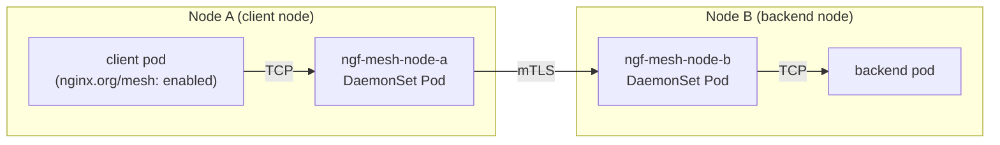

# Proposal: Mesh Gateway

- Status: Provisional

## Summary

Add a Mesh Gateway to NGINX Gateway Fabric, providing east/west service mesh with no per-pod proxy sidecars, built on the existing NGF control plane
rather than a separate mesh control plane. The mesh provides transparent mTLS by default and optional L4/L7/gRPC policy, with
distributed tracing for service-to-service traffic, activated by a single sender-side namespace annotation with no
application changes. A lightweight CNI plugin marks outbound packets; a TPROXY-based traffic interception plane in the host
network namespace redirects them to the local per-node NGINX DaemonSet, which handles mTLS and policy enforcement. The proposal
targets full GAMMA mesh compliance via the `parentRef: kind: Service` model defined in GEP-1294.

## Goals

- Encrypt all traffic flowing through the mesh via mTLS, including same-node traffic.
- Support TCPRoute, HTTPRoute, and GRPCRoute for E/W traffic. Routes are optional and add L4/L7/gRPC policy on
  top of automatic mTLS.
- Intercept traffic transparently via TPROXY in the host network namespace with no application changes.
- Opt-in per namespace (`nginx.org/mesh: enabled` annotation on the Namespace) or per workload
  (`nginx.org/mesh: enabled` annotation on the pod template). A single annotation on the sending namespace
  is sufficient; no annotation is required on the receiving namespace.
- Full GAMMA mesh compliance via `parentRef: kind: Service`.
- Enable the E/W mesh via a Helm install or upgrade; no user action is required to provision the data plane.
- Use Kubernetes pod certificates (KEP-4317) for per-pod mTLS identity; certificate provisioning and rotation
  are handled by the kubelet with no NGF controller involvement.
- Compatible with CNIs that use eBPF kube-proxy replacements (Cilium) without requiring special Cilium flags,
  because TPROXY operates in the host network namespace PREROUTING chain, before Cilium's socket-level LB.

## Non-Goals

- UDPRoute: NGINX cannot encrypt UDP (no DTLS support), so UDPRoute E/W is not supported. It may be reconsidered
  in the future if a viable encrypted UDP transport emerges.
- Authorization policy (restricting which services may call which other services): deferred to a future phase.
- Inbound traffic enforcement (blocking plain TCP to meshed pods from un-meshed sources): deferred to Phase 2.
- Multi-cluster connectivity: deferred to a future phase.

## Introduction

This proposal extends NGF to act as a service mesh. E/W and N/S config are reconciled by the same NGF controller
deployment, with no additional controller process required. The result is a full-capability mesh: mTLS,
L4/L7/gRPC policy, and distributed tracing, without any application changes.

The closest analogue in the ecosystem is **Istio ambient mode**, which also moves the proxy off the application
pod and onto the node (via a `ztunnel` DaemonSet). This proposal follows the same per-node model but differs in
several important ways:

- **No additional controller deployment.** Ambient mode requires Istiod alongside the existing NGF controller.
  This proposal adds E/W reconciliation to the existing NGF controller; no additional process or deployment is
  required.
- **No new CRDs.** Ambient mode introduces `AuthorizationPolicy`, `PeerAuthentication`, `Telemetry`, and other
  Istio-specific resources. This proposal uses only standard Gateway API resources (TCPRoute, HTTPRoute,
  GRPCRoute) that operators already know.
- **Unified N/S and E/W observability.** Metrics, access logs, and OTel traces from both traffic directions flow
  through the same NGINX pipeline and the same Prometheus/OTel configuration, with no separate telemetry stack.
- **Per-pod cryptographic identity.** The mesh uses Kubernetes pod certificates (KEP-4317) for
  per-pod mTLS identity. The kubelet provisions and rotates certificates automatically via a `podCertificate`
  projected volume; NGF requires no custom CA or cert rotation logic. Cluster trust is distributed via
  `ClusterTrustBundles`.

The routing model is **transparent** and **annotation-driven**. Annotating a namespace or workload with
`nginx.org/mesh: enabled` is all that is required to activate the mesh for traffic egressing from that namespace;
no Routes, no hostname changes, no code changes, and no annotation on receiving namespaces. A lightweight CNI
chained plugin runs at pod startup and installs a single packet-mark rule in the pod's network namespace. In the
host network namespace, per-service TPROXY rules redirect marked packets to the local NGINX DaemonSet on one of
two fixed interception ports: one for TCP/stream traffic (port `15001`) and one for HTTP/gRPC traffic (port
`15002`). The TPROXY rules are managed by a lightweight watcher within the DaemonSet pod that converges iptables state from a
controller-written ConfigMap. The NGF controller
watches
Namespace, Pod, Service, and Route objects and pushes per-node NGINX config to every per-node DaemonSet. NGINX
wraps the connection in mTLS and forwards it to the peer proxy on the destination node.

Routes (TCPRoute, HTTPRoute, GRPCRoute) are **optional**. Without a Route, traffic is encrypted with
mTLS but no L4 or L7 policy is applied. A TCPRoute adds L4 policy (timeouts). An HTTPRoute or GRPCRoute switches
the sending proxy to NGINX's HTTP module, enabling L7/gRPC policies and distributed tracing.

## Architecture

### Deployment Topology



All E/W traffic follows the same path regardless of protocol: client pod → packet mark (pod netns) → TPROXY redirect (host netns) → local proxy → mTLS → backend node proxy → backend pod.


### Components

| Component | Kind | Description |
|-----------|------|-------------|
| Per-node NGINX DaemonSet | `DaemonSet` | One per node, named `ngf-mesh-<node-name>`; pinned via `nodeSelector: kubernetes.io/hostname`; runs with `hostNetwork: true` and `CAP_NET_ADMIN` (seccomp-restricted); contains a TPROXY-setup init container, a packet-mark CNI installer init container, the NGINX + Agent container, and the TPROXY watcher; lives in the NGF namespace |
| TPROXY rules ConfigMap | `ConfigMap` | One per node, named `ngf-mesh-tproxy-<node-name>`; written by the NGF controller with the declarative set of TPROXY iptables rules for that node; mounted as a volume in the DaemonSet pod |
| TPROXY watcher | Container in DaemonSet pod | Long-running container in the DaemonSet pod; watches the mounted TPROXY rules ConfigMap for changes; diffs the desired rules against the current iptables mangle-table state and converges; requires `CAP_NET_ADMIN` and `hostNetwork: true`; has no Kubernetes API access |
| Pod Certificate | `podCertificate` projected volume | Per-pod certificate provisioned and rotated by the kubelet (KEP-4317); mounted into each proxy pod at a well-known path; no NGF controller involvement |
| ClusterTrustBundle | `ClusterTrustBundle` | Cluster-wide CA bundle distribution; read by proxy pods to verify peer certificates |


### Port Model

Three port categories are in play.

**1. TPROXY interception ports (sending node, fixed)**

Two fixed ports on the local NGINX proxy that receive TPROXY-redirected traffic from annotated pods.
The original destination (`ClusterIP:port`) is preserved by the TPROXY mechanism and visible to NGINX as
`$server_addr:$server_port`, which NGINX uses to select the correct upstream and policy.

| Port | Default | Use |
|------|---------|-----|
| TCP interception | `15001` | NGINX stream transparent listener; receives route-less and TCPRoute traffic |
| HTTP interception | `15002` | NGINX http transparent listener; receives HTTPRoute and GRPCRoute traffic (gRPC is HTTP/2) |

Both ports are fixed. No per-service port allocation is needed. Routing decisions are made by NGINX
using the preserved original destination.

**2. Inter-proxy mTLS ports (receiving node, fixed)**

Two fixed ports on every proxy pod, one per protocol family:

| Port | Default | Use |
|------|---------|-----|
| TCP inter-proxy | `19000` | Receives mTLS stream (TCPRoute and route-less) connections from peer proxies; SNI identifies the service |
| HTTP inter-proxy | `19001` | Receives HTTPS connections from peer proxies for HTTPRoute and GRPCRoute services; `Host` header identifies the service (gRPC is HTTP/2, so it shares this port) |

Both ports are configurable via `NginxProxy`. Neither is added to any Kubernetes Service; peer proxies connect
directly via pod IP.

**3. Native backend ports**

The port declared in the Service spec (e.g. `5432`, `80`, `50051`). The receiving proxy forwards to backend
pod IPs on these ports. The application never sees any proxy port; its connection target is unchanged at both
ends.

**Traffic flow: TCP (route-less or TCPRoute), e.g. `postgres-cluster-rw:5432`:**

1. App connects to `postgres-cluster-rw.postgres.svc.cluster.local:5432` (address unchanged)
2. Packet mark (pod netns) + TPROXY (host netns) silently redirect to local proxy port `15001`; original dst preserved
3. Local proxy forwards over mTLS stream to `<peer-proxy>:19000` (SNI: `db.postgres.ew.internal`)
4. Peer proxy delivers to `<backend-pod>:5432` over TCP

**Traffic flow: HTTP (HTTPRoute), e.g. `web-service:80`:**

1. App connects to `web-service.my-app.svc.cluster.local:80` (address unchanged)
2. Packet mark (pod netns) + TPROXY (host netns) silently redirect to local proxy port `15002`; original dst preserved
3. Local proxy forwards over HTTPS/H2 to `<peer-proxy>:19001` (Host: `web.my-app.ew.internal`)
4. Peer proxy delivers to `<backend-pod>:80` over HTTP

**Traffic flow: gRPC (GRPCRoute), e.g. `grpc-service:50051`:**

1. App connects to `grpc-service.my-app.svc.cluster.local:50051` (address unchanged)
2. Packet mark (pod netns) + TPROXY (host netns) silently redirect to local proxy port `15002`; original dst preserved
3. Local proxy forwards over gRPCS (H2 over TLS) to `<peer-proxy>:19001` (Host: `grpc-service.my-app.ew.internal`)
4. Peer proxy delivers to `<backend-pod>:50051` over gRPC

The application address is unchanged in all cases. The interception and proxy ports are entirely internal.

### Traffic Interception (TPROXY)

Traffic interception uses TPROXY in the host network namespace. Two layers work together: a lightweight CNI
chained plugin marks outbound TCP packets in each annotated pod's network namespace; per-service TPROXY rules in
the host network namespace redirect marked packets destined for meshed services to the local NGINX proxy on one
of two fixed transparent listener ports (`15001` stream, `15002` HTTP). Only traffic to known meshed services is
intercepted; traffic to non-meshed destinations passes through the host network namespace unmodified.

The DaemonSet pod runs with `hostNetwork: true` and `CAP_NET_ADMIN` (seccomp-restricted; see Security Model) and
contains four containers: two init containers that run in order, followed by two long-running containers (NGINX +
Agent and the TPROXY watcher).

**Init container 1: `ngf-mesh-tproxy-init` (privileged, exits)**

Configures the static host network namespace routing that makes TPROXY possible:

```bash
# Packets with fwmark 0x1 use routing table 100
ip rule add fwmark 0x1 lookup 100

# Table 100: all destinations are local, delivers TPROXY'd packets to local NGINX sockets
ip route add local 0.0.0.0/0 dev lo table 100
```

These commands need `CAP_NET_ADMIN` and `hostNetwork: true`. They are executed once at DaemonSet startup and
are idempotent if the pod restarts.

**Init container 2: `ngf-mesh-cni-install` (privileged, exits)**

Installs a lightweight CNI chained plugin on the host:

1. Copies the `ngf-mesh` binary to `/opt/cni/bin/ngf-mesh`.
2. Writes a chained config to `/etc/cni/net.d/` so `ngf-mesh` runs after the primary CNI plugin.

The hostPath volume mounts (`/opt/cni/bin/`, `/etc/cni/net.d/`) are scoped to this init container; the NGINX
container does not mount them.

When the container runtime calls the CNI plugin at pod `ADD`:

1. The plugin reads the pod's annotations and its namespace's annotations.
2. If `nginx.org/mesh: enabled` is present (pod annotation takes precedence, enabling per-pod opt-out via
   `nginx.org/mesh: disabled`), the plugin installs **one mark rule** in the pod's network namespace:

   ```bash
   iptables -t mangle -A OUTPUT \
     -p tcp ! -o lo \
     ! -m owner --uid-owner 101 \
     -j MARK --set-mark 0x1
   ```

   UID `101` is the NGINX user; its own traffic is excluded to prevent loops. This mark survives the veth
   crossing into the host network namespace where the TPROXY PREROUTING rules can act on it.

3. On pod `DEL` the network namespace is destroyed; no explicit cleanup is needed.

The plugin installs **one rule per pod**. TPROXY rules in the host netns handle the service-to-port mapping.

**Main container 1: `nginx` + `agent`**

Runs NGINX in the host network namespace, listening on the four fixed ports. NGINX Agent receives configuration
from the NGF controller over the gRPC channel; its scope is limited to NGINX configuration delivery, validation,
and reload.

**Main container 2: `ngf-mesh-tproxy-watcher`**

A long-running container in the DaemonSet pod that manages the per-service TPROXY iptables rules in the host network namespace. It
watches a mounted ConfigMap (`ngf-mesh-tproxy-<node-name>`) for changes. The ConfigMap contains the declarative
set of TPROXY rules for the node, written by the NGF controller whenever a service is enrolled, removed, or
reclassified. On each change the watcher diffs the desired state against the current iptables mangle-table
PREROUTING chain and converges: adding rules for new services, removing rules for withdrawn services, and
updating the target port when a service is reclassified (e.g. stream → HTTP).

The ConfigMap uses a simple line-oriented format; each line describes one service rule:

```
# <ClusterIP> <port> <interception-port>
10.0.0.10 5432 15001
10.0.0.11 6379 15001
10.0.0.50 80 15002
10.0.0.60 50051 15002
```

The watcher translates each line into the corresponding iptables rule:

```bash
# For each TCP/route-less service: redirect marked packets to stream interception port
iptables -t mangle -A PREROUTING \
  -m mark --mark 0x1 \
  -d <ClusterIP> -p tcp --dport <port> \
  -j TPROXY --tproxy-mark 0x1/0x1 --on-port 15001

# For each HTTP/gRPC service: redirect marked packets to HTTP interception port
iptables -t mangle -A PREROUTING \
  -m mark --mark 0x1 \
  -d <ClusterIP> -p tcp --dport <port> \
  -j TPROXY --tproxy-mark 0x1/0x1 --on-port 15002
```

The watcher requires `CAP_NET_ADMIN` and `hostNetwork: true` for iptables access. It has no Kubernetes API
access; its only input is the mounted ConfigMap volume. The kubelet propagates ConfigMap updates to the
mounted volume automatically (typically within a few seconds when the kubelet's watch-based change detection
is active). The watcher uses inotify on the mount path to detect changes without polling.

The watcher is a purpose-built binary with a single responsibility: converge iptables state from the ConfigMap. Only traffic to known meshed services is intercepted. Non-meshed traffic is never routed through NGINX.

Because TPROXY rules live in the **host** network namespace rather than per-pod network namespaces, they take
effect immediately for all annotated pods on the node. **Pods do not need to be restarted when a new service is
enrolled**. The TPROXY rule is active the moment the watcher converges the updated ConfigMap.

### eBPF kube-proxy Replacement Compatibility

TPROXY operates in the host network namespace PREROUTING chain. Cilium's socket-level LB hooks the `connect()`
syscall inside the pod's cgroup context, before the packet is formed. The TPROXY PREROUTING rule fires after the
packet crosses the veth into the host netns, which is after Cilium's socket LB has already rewritten the
destination.

This creates an ordering problem: if Cilium rewrites the ClusterIP to a backend pod IP before the packet reaches
the host netns, the TPROXY PREROUTING rule (which matches on ClusterIP) will not fire.

The fix is to set `socketLB.hostNamespaceOnly=true` to restrict Cilium's
socket LB to the host network namespace only, leaving pod-originated packets with the original ClusterIP address
until they reach the host netns PREROUTING chain.

| Cilium setting | Value | Purpose |
|---|---|---|
| `socketLB.hostNamespaceOnly` | `true` | Restricts Cilium's socket-level LB to the host netns. Pod-originated packets arrive at the host netns PREROUTING chain with the original ClusterIP, allowing TPROXY rules to match. |
| `cni.exclusive` | `false` | Prevents Cilium from renaming non-Cilium CNI configs; required for the `ngf-mesh` mark-only plugin to coexist. |

Other CNIs (Calico, Flannel, AWS VPC CNI, and others that do not replace kube-proxy) require no special
configuration.

### Provisioning Flow

The E/W mesh is enabled at install or upgrade time via a Helm flag:

```shell
helm upgrade --install nginx-gateway-fabric oci://ghcr.io/nginx/charts/nginx-gateway-fabric \
  --set mesh.enabled=true
```

When `mesh.enabled=true`, the NGF controller automatically creates in the NGF namespace:

1. A **per-node DaemonSet** (`ngf-mesh-<node-name>`) for each node currently in the cluster, and watches for
   Node events to create or delete DaemonSets as nodes join or leave. Each DaemonSet pod's init container
   installs the CNI plugin binary and config on the host before NGINX starts. Each pod declares a
   `podCertificate` projected volume; the kubelet provisions and rotates its certificate automatically.
2. A **per-node TPROXY rules ConfigMap** (`ngf-mesh-tproxy-<node-name>`) for each node, mounted as a volume in
   the DaemonSet pod. The controller writes the declarative set of TPROXY rules to this ConfigMap; the TPROXY
   watcher watches for changes and converges the host netns iptables state.
3. A **ConfigMap** for NGINX Agent configuration (same pattern as today).

No user action is required to provision the data plane. Users annotate namespaces or workloads; Routes are
optional and add policy on top.

Each per-node DaemonSet is pinned to its node via `nodeSelector: kubernetes.io/hostname: <node-name>` and
inherits the node's taints as tolerations at creation time.

**Service discovery.** The NGF controller watches Namespace, Pod, Service, and EndpointSlice objects. When a
namespace or pod gains `nginx.org/mesh: enabled`, the controller enumerates all Services in that namespace whose
selector matches at least one meshed pod. For each such service the controller:

1. Classifies the service as **stream** (no HTTPRoute or GRPCRoute exists) or **HTTP** (an HTTPRoute or GRPCRoute
   exists). This classification determines which TPROXY interception port (`15001` or `15002`) is written to the
   node's TPROXY rules ConfigMap.
2. Generates a **distinct NGINX configuration per node** and delivers each via the NGINX Agent gRPC channel to
   the corresponding per-node DaemonSet. The config includes the service's ClusterIP:port → upstream mapping
   and any applicable Route policy.
3. Updates the node's `ngf-mesh-tproxy-<node-name>` ConfigMap with the service's ClusterIP, port, and
   interception port. The TPROXY watcher detects the ConfigMap change and converges the host netns
   iptables rules accordingly.

Because TPROXY rules live in the host network namespace, they take effect immediately for all currently-running
annotated pods on the node. No pod restart is required when a new service is enrolled.

When the last meshed pod for a service is gone (namespace annotation removed or all pods restarted without the
annotation), the TPROXY rule for that service is removed and the NGINX config entry is deleted.

**Route creation (optional, adds policy).** When a TCPRoute, HTTPRoute, or GRPCRoute with
`parentRef: kind: Service` is created, the NGF controller:

1. Reclassifies the service if the Route changes its protocol category (e.g. a service was stream and an
   HTTPRoute is now added, it becomes HTTP). The controller updates the TPROXY rules ConfigMap with the new
   interception port; the TPROXY watcher converges the iptables entry. NGINX reloads its listeners
   accordingly.
2. Regenerates the per-node NGINX configuration incorporating the Route's policy (timeouts for TCPRoute;
   header rules, path matching, retries for HTTPRoute; service/method matching, header rules, traffic splitting
   for GRPCRoute).
3. Sets `Accepted: True` on the Route once all per-node configs are pushed.

When a Route is deleted, the NGINX config reverts to route-less mTLS (stream mode regardless of any prior HTTP
classification) and the TPROXY entry is reclassified back to port `15001`.

### Controller Reconciliation

**Per-node DaemonSet lifecycle.** NGF watches Node events. When a node joins the cluster, NGF creates a
`ngf-mesh-<node-name>` DaemonSet pinned to that node and pushes its initial NGINX config via the Agent gRPC
channel. When a node leaves, NGF deletes the corresponding DaemonSet.

**Service lifecycle.** For each service with at least one meshed backend pod, the controller maintains an
in-memory record of its ClusterIP, native port, protocol classification, and per-node backend pod IPs (from
EndpointSlices). On controller restart the leader rebuilds this state by listing Services, Pods, Namespaces, and
EndpointSlices; no Service annotation is needed for recovery. The NGF controller uses leader election, so
concurrent reconciliation races are not a concern.

**RBAC implications.** The NGF controller does not need permission to create `Services` or `EndpointSlices` in
user namespaces. It requires read access to `Namespaces`, `Pods`, `Services`, and `EndpointSlices` cluster-wide,
write access to `Node` annotations, and write access to `ConfigMaps` in the NGF namespace (for the per-node
TPROXY rules ConfigMaps).

### NGINX Configuration

The NGF controller reads EndpointSlices (read-only, no modifications) to determine which backend pod IPs are on
which nodes. It generates a distinct NGINX configuration per node and pushes each via the Agent to the
corresponding per-node DaemonSet. Services are handled in one of two modes depending on whether an HTTPRoute
exists for them.

#### Listener ports

**Sending node:**
- **TCP interception port** (`15001`): NGINX `stream` transparent listener. All route-less and TCPRoute traffic
  lands here. `$server_addr:$server_port` reflects the original ClusterIP:port (preserved by TPROXY), which
  NGINX uses to select the correct upstream and SNI.
- **HTTP interception port** (`15002`): NGINX `http` transparent listener. All HTTPRoute and GRPCRoute traffic
  lands here. The same `$server_addr:$server_port` map selects the upstream; `proxy_http_version 2` is used on
  the inter-proxy channel for both HTTP and gRPC (gRPC is HTTP/2). For services that carry rich L7 policy (path
  matching, per-route retries, etc.) the controller generates per-service server blocks using
  `listen <ClusterIP>:<port> transparent`, binding directly to the ClusterIP:port with `IP_TRANSPARENT`.

**Receiving node:**
- **TCP inter-proxy port** (`19000`): stream `listen ssl`; SNI identifies the service.
- **HTTP inter-proxy port** (`19001`): HTTP `listen ssl`; `Host` header identifies the service.
- **Native backend port**: target of the upstream on the receiving node.

#### TCPRoute / route-less: sending node (stream context)

```nginx
stream {
    # Map original destination ClusterIP:port → upstream and SNI.
    # $server_addr and $server_port reflect the ORIGINAL destination preserved by TPROXY.
    map "$server_addr:$server_port" $ngf_mesh_tcp_upstream {
        "10.0.0.10:5432"  ngf_mesh_db_postgres_inter;
        "10.0.0.11:6379"  ngf_mesh_redis_inter;
    }

    map "$server_addr:$server_port" $ngf_mesh_tcp_sni {
        "10.0.0.10:5432"  db.postgres.ew.internal;
        "10.0.0.11:6379"  redis.my-app.ew.internal;
    }

    # All per-node proxy pod IPs on the TCP inter-proxy port (19000).
    upstream ngf_mesh_db_postgres_inter {
        server 10.0.1.100:19000;
        server 10.0.2.100:19000;
    }

    upstream ngf_mesh_redis_inter {
        server 10.0.1.100:19000;
        server 10.0.2.100:19000;
    }

    server {
        # Single transparent listener; TPROXY delivers only known stream services here.
        listen                        15001 transparent;
        proxy_pass                    $ngf_mesh_tcp_upstream;
        proxy_ssl                     on;
        proxy_ssl_certificate         /var/run/secrets/pod-certificate/tls.crt;
        proxy_ssl_certificate_key     /var/run/secrets/pod-certificate/tls.key;
        proxy_ssl_trusted_certificate /var/run/secrets/cluster-trust-bundle/ca.crt;
        proxy_ssl_verify              on;
        proxy_ssl_server_name         on;
        proxy_ssl_name                $ngf_mesh_tcp_sni;

        # TCPRoute policy (absent for route-less): per-service timeouts applied via
        # per-service server blocks using listen <ClusterIP>:<port> transparent when needed.
    }
}
```

#### TCPRoute / route-less: receiving node (stream context)

```nginx
stream {
    # SNI → upstream mapping; one entry per TCP/route-less service on this proxy.
    map $ssl_server_name $ngf_mesh_tcp_upstream {
        db.postgres.ew.internal  ngf_mesh_db_postgres_local;
        redis.my-app.ew.internal ngf_mesh_redis_local;
    }

    upstream ngf_mesh_db_postgres_local {
        # Only backend pod IPs resident on THIS node.
        server 10.0.1.8:5432;
    }

    upstream ngf_mesh_redis_local {
        server 10.0.1.9:6379;
    }

    server {
        listen                 19000 ssl;
        ssl_certificate        /var/run/secrets/pod-certificate/tls.crt;
        ssl_certificate_key    /var/run/secrets/pod-certificate/tls.key;
        ssl_client_certificate /var/run/secrets/cluster-trust-bundle/ca.crt;
        ssl_verify_client      on;
        ssl_protocols          TLSv1.3;
        proxy_pass             $ngf_mesh_tcp_upstream;
    }
}
```

#### HTTPRoute and GRPCRoute: sending node (HTTP context)

Both HTTPRoute and GRPCRoute traffic arrives at port `15002`. The inter-proxy channel uses HTTP/2 over TLS for
both protocols. `proxy_http_version 2` is set so gRPC frames are forwarded correctly; the receiving proxy
applies the appropriate `grpc_pass` or `proxy_pass` directive for the final backend hop.

```nginx
http {
    # Map original destination → upstream and Host header.
    map "$server_addr:$server_port" $ngf_mesh_http_upstream {
        "10.0.0.50:80"    ngf_mesh_web_my-app_inter;
        "10.0.0.60:50051" ngf_mesh_grpc_my-app_inter;
    }

    map "$server_addr:$server_port" $ngf_mesh_http_host {
        "10.0.0.50:80"    web.my-app.ew.internal;
        "10.0.0.60:50051" grpc-service.my-app.ew.internal;
    }

    upstream ngf_mesh_web_my-app_inter {
        server 10.0.1.100:19001;
        server 10.0.2.100:19001;
        server 10.0.3.100:19001;
    }

    upstream ngf_mesh_grpc_my-app_inter {
        server 10.0.1.100:19001;
        server 10.0.2.100:19001;
        server 10.0.3.100:19001;
    }

    server {
        # Single transparent HTTP listener for all HTTP+gRPC services.
        listen 15002 transparent;
        http2  on;

        location / {
            proxy_pass                    https://$ngf_mesh_http_upstream;
            proxy_http_version            2;
            proxy_ssl_certificate         /var/run/secrets/pod-certificate/tls.crt;
            proxy_ssl_certificate_key     /var/run/secrets/pod-certificate/tls.key;
            proxy_ssl_trusted_certificate /var/run/secrets/cluster-trust-bundle/ca.crt;
            proxy_ssl_verify              on;
            proxy_set_header              Host $ngf_mesh_http_host;
        }
    }
}
```

For services with rich HTTPRoute policy (path matching, per-route retries, header rules), the controller
generates a dedicated `server` block using `listen <ClusterIP>:<port> transparent`, allowing standard NGINX
`location` blocks and directives to be applied per service without ambiguity.

#### HTTPRoute: receiving node (HTTP context)

```nginx
http {
    upstream ngf_mesh_web_my-app_local {
        # Only backend pod IPs resident on THIS node.
        server 10.0.1.9:80;
    }

    server {
        listen              19001 ssl;
        server_name         web.my-app.ew.internal;
        ssl_certificate     /var/run/secrets/pod-certificate/tls.crt;
        ssl_certificate_key /var/run/secrets/pod-certificate/tls.key;
        ssl_client_certificate /var/run/secrets/cluster-trust-bundle/ca.crt;
        ssl_verify_client   on;
        ssl_protocols       TLSv1.3;

        location / {
            proxy_pass http://ngf_mesh_web_my-app_local;
        }
    }
}
```

#### GRPCRoute: receiving node (HTTP context)

The receiving proxy terminates mTLS from the peer proxy and forwards plain gRPC (H2C) to the local backend pods.
It shares `listen 19001 ssl` with HTTPRoute; a single virtual server handles both, distinguished by `server_name`.

```nginx
http {
    upstream ngf_mesh_grpc_my-app_local {
        # Only backend pod IPs resident on THIS node.
        server 10.0.1.10:50051;
    }

    server {
        listen              19001 ssl;
        server_name         grpc-service.my-app.ew.internal;
        ssl_certificate     /var/run/secrets/pod-certificate/tls.crt;
        ssl_certificate_key /var/run/secrets/pod-certificate/tls.key;
        ssl_client_certificate /var/run/secrets/cluster-trust-bundle/ca.crt;
        ssl_verify_client   on;
        ssl_protocols       TLSv1.3;
        http2               on;

        location / {
            grpc_pass grpc://ngf_mesh_grpc_my-app_local;
        }
    }
}
```

### Phase 1 Reload Mitigation

In the baseline implementation, every EndpointSlice change (pod scaling, rolling updates) triggers a config
push via Agent and an `nginx -s reload` on the affected per-node proxy. Without mitigation, a cluster with 50
services and frequent deploys could produce dozens of reloads per minute per node. Each reload spawns new
worker processes and drains old ones, with a cost of ~100–200ms of elevated resource usage per reload and
potential disruption to in-flight stream connections (see [Known Limitation: Stream Connection Disruption
During Reloads](#known-limitation-stream-connection-disruption-during-reloads)).

Phase 1 ships with three reload mitigations that are always active:

**1. Reload coalescing**

The controller batches EndpointSlice changes within a configurable window (default: 1s). When multiple
EndpointSlice updates arrive within the window, they are merged into a single config push and reload.
A rolling update of 20 pods that completes in 60s produces 1–2 reloads per node, not 20.

**2. Reload rate limiting**

A per-node rate limit (default: max 1 reload per 5s) prevents reload storms during high-churn events such as
cluster autoscaler scale-ups or large batch job completions. When the rate limit is hit, pending changes are
queued and delivered in the next reload window. This bounds the worst case: even under continuous endpoint
churn, a node will not reload more than 12 times per minute.

**3. Worker drain timeout**

`worker_shutdown_timeout` is set to a configurable value (default: 60s) on all per-node proxies. Old worker
processes remain alive to service existing connections for the duration of the timeout after a reload.
This allows in-flight HTTP requests and short-lived TCP transactions to complete without disruption.
Long-lived stream connections that exceed the timeout are still affected (see stream connection limitation
section).

**Reload frequency bounds:**

| Scenario | Reloads/min/node (without mitigation) | Reloads/min/node (with mitigation) |
|----------|---------------------------------------|-------------------------------------|
| Steady state (no deploys) | 0 | 0 |
| Single 20-replica rolling update | ~20 | 1–2 |
| 5 concurrent rolling updates (100 pods total) | ~100 | 6–12 |
| Continuous endpoint churn | Unbounded | ≤12 (rate limit) |

**Monitoring:**

- `ngf_mesh_reload_total{node}`: counter of reloads per node.
- `ngf_mesh_reload_duration_seconds{node}`: histogram of reload duration.
- `ngf_mesh_reload_pending_changes{node}`: gauge of coalesced changes waiting for the next reload window.

These metrics are available via the same Prometheus endpoint as existing NGF metrics.

**Configuration via `NginxProxy`:**

```yaml
spec:
  eastWest:
    reloadCoalesceWindow: 1s     # batch EndpointSlice changes within this window (default: 1s)
    reloadRateLimit: 5s          # minimum interval between reloads per node (default: 5s)
    workerShutdownTimeout: 60s   # drain timeout for old workers after reload (default: 60s)
```

**What triggers a reload in Phase 1:**

| Event | Reload required |
|-------|-----------------|
| EndpointSlice change (pod scaling, rolling update) | Yes (coalesced + rate-limited) |
| New service enrollment | Yes (new `map` entry + TPROXY rule) |
| Service reclassification (stream ↔ HTTP) | Yes |
| Route creation or deletion | Yes |
| Certificate rotation | No (variable in `ssl_certificate`, see [Certificate Management](#certificate-management)) |

Reload-free upstream updates for HTTP-context services via the NGINX `eval` directive are planned for Phase 2
(see [Appendix: Reload-Free Upstream Updates via `eval`](#appendix-reload-free-upstream-updates-via-eval)).

### Known Limitation: Stream Connection Disruption During Reloads

In the stream context (route-less and TCPRoute services on port 15001), each `nginx -s reload` spawns new worker
processes. Old workers enter a draining state but **cannot hand off in-flight TCP connections** to new workers.
Long-lived connections — database pools (postgres, Redis), gRPC streams without routes, message broker links — are
the traffic patterns most affected. The `eval` directive (Phase 2) addresses this for HTTP-context upstreams, but
**stream-context traffic has no reload-free upstream update path** in any planned NGINX version.

This is a fundamental limitation of NGINX's process model for stream proxying and applies to all stream-context
services indefinitely, not just Phase 1.

**Phase 1 mitigations:**

- **`worker_shutdown_timeout`**: configure a generous drain timeout (e.g., 60–120s) so old workers remain alive
  to service existing connections while new workers handle incoming ones. This does not prevent disruption, but
  allows in-flight transactions to complete before the old worker exits.
- **Reload coalescing**: the controller batches EndpointSlice changes within a configurable window (default: 1s)
  so a rolling update of N pods produces 1–2 reloads per node, not N. A rate limit (default: max 1 reload per
  5s per node) prevents reload storms during high-churn events. Combined, a 20-replica rolling update that
  completes in 60s produces at most 12 reloads rather than 20.
- **Reload metrics**: expose `ngf_mesh_reload_total` and `ngf_mesh_reload_duration_seconds` Prometheus metrics
  per node so operators can observe reload frequency and correlate with connection disruption.

**Application-level guidance:**

Database clients should use connection poolers (PgBouncer, Odyssey, ProxySQL) in front of the database.
Connection poolers handle transient disconnects transparently by re-establishing backend connections without
propagating errors to the application. This is standard practice for any proxy-based or mesh architecture and
is not specific to NGF.

For gRPC, clients using standard gRPC libraries with retry and reconnect policies (the default in most
implementations) will automatically re-establish streams after a reload-induced disconnect.

**Long-term path:**

A future NGINX enhancement to support `NGX_DYNAMIC_MODULE` in the stream context would enable reload-free
upstream updates for TCP services, closing this gap. This is tracked as a roadmap dependency. Until then,
stream-context reload disruption is a known trade-off that operators should be aware of when meshing
latency-sensitive TCP services.

## Protocol Support

### Route-less (annotation only)

When a namespace or workload carries `nginx.org/mesh: enabled` but no Route exists for a given service, the
mesh provides mTLS with no L4 or L7 policy applied. The sending proxy forwards to peer proxies via
the stream context (port 19000, SNI routing). This is the zero-configuration baseline.

### TCPRoute

Builds on route-less mTLS by adding L4 policy: connect and read timeouts via `proxy_connect_timeout` /
`proxy_timeout`. Traffic is intercepted at port `15001` (stream transparent); the inter-proxy channel uses
port `19000`. The `createStreamServers` / `processLayer4Servers` pipeline is extended with map-based
original-destination routing and SNI-based inter-proxy routing.

### HTTPRoute

Full support via the NGINX HTTP module. When an HTTPRoute exists for a service, the sending proxy switches from
stream context to HTTP context and uses the HTTP inter-proxy port (19001). L7 policies available in Phase 1:

| Feature | Notes |
|---------|-------|
| Path-based routing | `PathPrefix`, `Exact`, `RegularExpression` match types |
| Header manipulation | `RequestHeaderModifier`, `ResponseHeaderModifier` filters |
| Retries | `retry` policy on `BackendRef` |
| Traffic splitting | Multiple `backendRefs` with `weight` |
| OpenTelemetry tracing | Trace context injected at the sending proxy; `ngx_otel_module` |

The receiving proxy handles HTTPRoute services in NGINX's HTTP context and forwards plain HTTP to the local
backend pods. The `Host` header identifies the service on the inter-proxy channel (no SNI needed).

### GRPCRoute

Full support via NGINX's `ngx_http_grpc_module`. GRPCRoute is GA in Gateway API v1 since v1.1. When a
GRPCRoute exists for a service, the sending proxy uses `grpc_pass` over the HTTP inter-proxy port (19001, shared
with HTTPRoute since gRPC is HTTP/2). gRPC-specific policies available in Phase 1:

| Feature | Notes |
|---------|-------|
| Service/method matching | Match on gRPC service name, method name, or both |
| Header matching | Match on request metadata headers |
| Header manipulation | `RequestHeaderModifier`, `ResponseHeaderModifier` filters |
| Traffic splitting | Multiple `backendRefs` with `weight` |
| OpenTelemetry tracing | Trace context propagated via gRPC metadata; `ngx_otel_module` |

The receiving proxy uses `grpc_pass` to forward to local backend pods over plaintext gRPC (mTLS is terminated
at the inter-proxy boundary). The `Host` header identifies the service on port 19001.

### UDPRoute

Not supported. NGINX has no DTLS capability and tunnelling UDP over a TLS-wrapped TCP connection alters the
transport semantics (ordering, timing, loss behaviour) in ways that are visible to applications.

UDPRoute E/W may be reconsidered in a future release if a viable encrypted UDP transport becomes available.

## Certificate Management

The mesh uses **Kubernetes pod certificates** (KEP-4317) for mTLS identity. This
eliminates the need for NGF to manage a custom CA, issue certificates, or run a rotation loop. All certificate
lifecycle is handled by the kubelet.

### Per-pod provisioning

Each proxy pod declares a `podCertificate` projected volume in its DaemonSet spec. The kubelet provisions a
certificate for the pod before it starts, mounts it at a well-known path (e.g., `/var/run/secrets/pod-certificate`),
and rotates it automatically before expiry. NGINX is configured with a variable in `ssl_certificate`/`ssl_certificate_key`, so rotated certificates are picked up on new connections without a reload. This works in both `http` and `stream` contexts; variable support in `ssl_certificate` was added to both modules in [NGINX 1.15.9](https://nginx.org/en/docs/stream/ngx_stream_ssl_module.html#ssl_certificate) (requires OpenSSL 1.0.2+). Certificate rotation therefore never requires a reload in either context.

```yaml
volumes:
  - name: pod-cert
    projected:
      sources:
        - podCertificate: {}
```

Each proxy pod receives its own unique certificate tied to its pod identity. This provides **per-pod
cryptographic identity**, a meaningful improvement over a shared cluster-wide certificate.

### Trust distribution

Peer certificate verification uses `ClusterTrustBundles`, the Kubernetes-native mechanism for distributing CA
bundles cluster-wide. Proxy pods read the trust bundle from a projected volume and present it to NGINX as the
trusted CA list for verifying peer proxy certificates.

### Requirements

- Kubernetes 1.35 or later.
- A compatible cluster signer configured to sign `PodCertificateRequest` objects.

### NGF controller impact

NGF has no involvement in certificate issuance or rotation. The controller does not need to generate a CA,
store a CA key, or watch certificate expiry.

## Cluster-Scoped Operation

The E/W mesh is cluster infrastructure, not per-namespace infrastructure. There is one per-node DaemonSet per
node, all in the NGF namespace.

- Routes in any namespace reference their backend Service via `parentRef: kind: Service`.
- Certificate provisioning and rotation are handled by the kubelet via pod certificates (KEP-4317); no cert
  material is stored in the NGF namespace.
- The proxy pod ServiceAccount has no Kubernetes API access (same principle of least privilege as the N/S data
  plane). The CNI plugin binary calls the Kubernetes API using the node's kubelet credential (standard for CNI
  plugins) and is scoped to read Namespaces and Pods only.

## User Workflow

### Step 1: Platform team

```shell
helm upgrade --install nginx-gateway-fabric oci://ghcr.io/nginx/charts/nginx-gateway-fabric \
  --set mesh.enabled=true
```

NGF creates a per-node DaemonSet for each cluster node automatically. No further infrastructure work is required from the platform team.

If Cilium is used as a kube-proxy replacement, install it with the following options before deploying NGF:

```shell
helm upgrade --install cilium cilium/cilium \
  --set cni.exclusive=false \
  --set socketLB.hostNamespaceOnly=true
```

E/W proxy behaviour is tuned via `NginxProxy`:

```yaml
spec:
  eastWest:
    tcpInterceptionPort:  15001    # TPROXY stream interception port (default: 15001)
    httpInterceptionPort: 15002    # TPROXY HTTP interception port (default: 15002)
    interNodePort:        19000    # TCP inter-proxy mTLS port (default: 19000)
    interNodeHttpPort:    19001    # HTTP inter-proxy mTLS port (default: 19001)
```

### Step 2: Application team

```shell
kubectl annotate namespace my-app nginx.org/mesh=enabled
```

**This is all that is required.** NGF automatically discovers every Service reachable from `my-app`, classifies
each as stream or HTTP, and pushes NGINX config and TPROXY interception rules to all per-node proxies. New pods
starting in the namespace receive a single packet-mark rule from the CNI plugin. Traffic to any service with
meshed backend pods is encrypted with mTLS; no Route, no hostname change, no code change, and no
annotation on the receiving namespace.

| Annotation | Target | Values | Effect |
|---|---|---|---|
| `nginx.org/mesh` | `Namespace` | `enabled` | All pods starting in this namespace have their outbound TCP intercepted |
| `nginx.org/mesh` | Pod template (`spec.template.metadata.annotations`) | `enabled` / `disabled` | Per-workload override; `disabled` opts out even within an annotated namespace |

| | Before | After annotation |
|---|---|---|
| Connection string | `postgres://postgres-cluster-rw.postgres.svc.cluster.local:5432` | `postgres://postgres-cluster-rw.postgres.svc.cluster.local:5432` |
| What changes | | Traffic is transparently mTLS-encrypted via the per-node proxies |

**Cross-namespace traffic works with a single annotation.** A pod in `my-app` connecting to a Service in
`postgres` only requires `my-app` to be annotated. The TPROXY interception plane in the host network namespace
routes the traffic regardless of which namespace the destination Service lives in. The `postgres` namespace does
not need to be annotated.

To opt **out**, remove the namespace annotation. The mark rule is removed from newly-starting pods immediately;
the TPROXY host rules are withdrawn when the last annotated pod on the node exits.

### Step 3: Application team (optional, for policy only)

Routes are not required for mTLS. Create a Route only when L4 or L7 policy is needed.

**TCPRoute (adds L4 policy: timeouts):**

```yaml
apiVersion: gateway.networking.k8s.io/v1alpha2
kind: TCPRoute
metadata:
  name: postgres
  namespace: my-app
  annotations:
    nginx.org/proxy-connect-timeout: "5s"   # time to establish connection to backend
    nginx.org/proxy-timeout: "300s"         # idle timeout for the proxied connection
spec:
  parentRefs:
    - name: postgres-cluster-rw
      namespace: postgres
      kind: Service
      group: ""
  rules:
    - backendRefs:
        - name: postgres-cluster-rw
          namespace: postgres
          port: 5432
```

**HTTPRoute (adds L7 policy: timeouts, retries, header manipulation, tracing):**

```yaml
apiVersion: gateway.networking.k8s.io/v1
kind: HTTPRoute
metadata:
  name: web
  namespace: my-app
spec:
  parentRefs:
    - name: web-service
      namespace: my-app
      kind: Service
      group: ""
  rules:
    - matches:
        - path:
            type: PathPrefix
            value: /api
      timeouts:
        request: 10s
        backendRequest: 5s
      retry:
        attempts: 3
        backoff: 250ms
        codes: [502, 503, 504]
      filters:
        - type: RequestHeaderModifier
          requestHeaderModifier:
            add:
              - name: X-Forwarded-By
                value: ngf-mesh
      backendRefs:
        - name: web-service
          port: 80
```

**GRPCRoute (adds gRPC policy: service/method matching, header manipulation, traffic splitting, tracing):**

```yaml
apiVersion: gateway.networking.k8s.io/v1
kind: GRPCRoute
metadata:
  name: grpc-service
  namespace: my-app
spec:
  parentRefs:
    - name: grpc-service
      namespace: my-app
      kind: Service
      group: ""
  rules:
    - matches:
        - method:
            service: com.example.Greeter
            method: SayHello
      filters:
        - type: RequestHeaderModifier
          requestHeaderModifier:
            add:
              - name: X-Forwarded-By
                value: ngf-mesh
      backendRefs:
        - name: grpc-service
          port: 50051
          weight: 90
        - name: grpc-service-canary
          port: 50051
          weight: 10
```

NGF regenerates the NGINX config for the affected service incorporating the Route's policy. For HTTPRoute and
GRPCRoute, the sending proxy switches to HTTP context enabling L7/gRPC policy and tracing. The application
connection string is unchanged in all cases; switching from no Route to a Route never requires an application
change.

## GAMMA Initiative Support

The [GAMMA initiative](https://gateway-api.sigs.k8s.io/concepts/gamma/) defines how Gateway API resources can
express service mesh (E/W) intent, notably by allowing a Route's `parentRef` to point to a `Service` rather than
a `Gateway`. This is standardised in [GEP-1294](https://gateway-api.sigs.k8s.io/geps/gep-1294/).

This proposal achieves **full GAMMA mesh compliance**:

- Routes use `parentRef: kind: Service` exclusively, the standard GAMMA mechanism for declaring E/W intent.
- Traffic interception is **transparent**: application pods are not aware of the proxy. The TPROXY rules
  installed in the host network namespace redirect traffic without any change to the application's connection targets.
- Opt-in is controlled by a single sender-side namespace or workload annotation, matching the GAMMA
  expectation that mesh adoption requires minimal application friction.

When NGF detects a Route with `parentRef.kind: Service`, it proceeds with config generation. No Route is required
for a service to be meshed; if none exists, the service operates in route-less mode with mTLS and no policy.

### Spec conformance

GEP-1294 lists `HTTP`, `GRPC`, `TCP`, `TLS`, and `UDP` as route types *available for use* in a mesh
implementation; they are opt-in capabilities, not conformance requirements. The core GAMMA conformance
requirements are: (1) support `Service` as a `parentRef` target, (2) report Route status, and (3) route traffic
according to `backendRef` specifications. This proposal satisfies all three.

TCPRoute and HTTPRoute with `parentRef: kind: Service` are both spec-conformant under GEP-1294. UDPRoute is not
supported (NGINX has no DTLS capability), but omitting it does not affect GAMMA mesh compliance; no route type
is required by the spec.

### Full transparent interception

Traffic interception is fully transparent: application pods are not aware of the proxy and connect to backend
services using the same DNS name and port they always have. The mesh is activated by annotating the namespace,
not by modifying application configuration.

## Observability

Each per-node proxy is configured with the same observability stack as the N/S data plane:

- **Prometheus metrics**: standard NGINX metrics plus E/W labels `ngf_mesh_src_node`, `ngf_mesh_dst_node`, `ngf_mesh_encrypted`.
- **Access logs**: structured JSON including upstream node, encryption status, and upstream response time.
- **OpenTelemetry traces**: available for **HTTPRoute** and **GRPCRoute** services in Phase 1 via
  `ngx_otel_module`. The sending proxy injects trace context (HTTP headers for HTTPRoute; gRPC metadata for
  GRPCRoute); a single trace ID covers the full client → proxy → peer proxy → backend path. Not available for
  route-less or TCPRoute services, as the stream module has no header visibility for TCP trace propagation.

## Policy

mTLS between proxies is always on and is not configurable; it is a property of the mesh itself.

Supported policies for E/W traffic in Phase 1:

| Policy | Applies to | Notes |
|--------|-----------|-------|
| Timeouts | TCPRoute | Connect and read timeouts via `proxy_connect_timeout` / `proxy_timeout` |
| Path-based routing | HTTPRoute | `PathPrefix`, `Exact`, `RegularExpression` |
| Header manipulation | HTTPRoute, GRPCRoute | `RequestHeaderModifier`, `ResponseHeaderModifier` filters |
| Retries | HTTPRoute | `retry` on `BackendRef` |
| Traffic splitting | HTTPRoute, GRPCRoute | Multiple `backendRefs` with `weight` |
| OpenTelemetry tracing | HTTPRoute, GRPCRoute | Trace context injected at the sending proxy; gRPC metadata propagation |
| Service/method matching | GRPCRoute | Match on gRPC service name, method name, or both |
| gRPC header matching | GRPCRoute | Match on request metadata headers |

Rate limiting is deferred to Phase 2; JWT authentication (NGINX Plus) is deferred to Phase 3.

## Security Model

| Concern | Mitigation |
|---------|-----------|
| Certificate provisioning | Handled entirely by the kubelet via KEP-4317 pod certificates; NGF does not store or manage any CA key material |
| Proxy cert compromise | Per-pod certificates with automatic kubelet rotation; compromise is limited to a single pod identity |
| Rogue proxy joins | mTLS requires a certificate signed by a cluster-trusted signer; only the kubelet can provision pod certificates |
| All E/W traffic encrypted | All E/W traffic is mTLS-encrypted, including same-node (loopback through the local proxy); trust is established via ClusterTrustBundles |
| Proxy pod privileges | The proxy pod requires `hostNetwork: true` and `CAP_NET_ADMIN`. The NGINX + Agent container needs `CAP_NET_ADMIN` only for `setsockopt(IP_TRANSPARENT)` and `bind` on TPROXY sockets. The TPROXY watcher needs `CAP_NET_ADMIN` for iptables mangle-table mutations. Routing-table modification (`RTM_NEWROUTE`, `RTM_NEWRULE`) is permitted only for the init container and blocked for both main containers. No `hostPID`. |
| Seccomp scope | The NGINX + Agent container is bound by a `Localhost` seccomp profile that allows only the syscalls required for NGINX operation and `IP_TRANSPARENT` socket options. The TPROXY watcher has a separate `Localhost` seccomp profile that allows iptables mangle-table writes and inotify syscalls. Operations that `NET_ADMIN` would otherwise permit (interface configuration, IP aliasing, bridge manipulation, raw socket creation) are blocked in both profiles. |
| API access from data plane | Neither the NGINX + Agent container nor the TPROXY watcher has Kubernetes API access. The watcher's only input is the mounted ConfigMap volume. EndpointSlices are read by the controller only. |
| CNI plugin privileges | The `ngf-mesh-cni-install` init container runs as root with `CAP_NET_ADMIN` and mounts hostPath volumes for `/opt/cni/bin/` and `/etc/cni/net.d/`. These mounts are scoped to the init container only. The CNI plugin binary (called by the container runtime at pod ADD time) runs as root with `CAP_NET_ADMIN` and installs **one** iptables mangle mark rule per annotated pod; it reads Namespaces and Pods from the Kubernetes API via the node's kubelet credential. The blast radius is limited to a single mark rule in the pod's own network namespace. |
| Controller RBAC | The NGF controller does not require permission to create `Services` or `EndpointSlices` in user namespaces. It requires read access to `Namespaces`, `Pods`, `Services`, and `EndpointSlices` cluster-wide, write access to `Node` annotations, and write access to `ConfigMaps` in the NGF namespace (for the per-node TPROXY rules ConfigMaps). All NGF-managed objects carry `app.kubernetes.io/managed-by: nginx-gateway-fabric` for auditability. |
| New services on running pods | Because TPROXY rules live in the host network namespace, they take effect immediately for all annotated pods on the node when a new service is enrolled. No pod restart is required. |

## Implementation Phases

| Phase | Scope |
|-------|-------|
| 1 | Per-node DaemonSet with TPROXY interception and per-pod mTLS (KEP-4317). Route-less mTLS, TCPRoute, HTTPRoute, GRPCRoute. OTel tracing and Prometheus metrics. Reload coalescing, rate limiting, and worker drain timeout. |
| 2 | Inbound traffic enforcement (blocking plain-TCP from un-meshed sources); egress traffic management; rate limiting; reload-free upstream updates via `eval` directive (requires nginx 1.29.8+) |
| 3 | JWT authentication (NGINX Plus); multi-cluster connectivity |

**Future considerations**: BackendTLSPolicy integration for backend-side TLS; eBPF-based interception to reduce long-lived `NET_ADMIN` requirement.

## Alternatives Considered

### Explicit hostname opt-in via synthetic Services

An alternative was to create `ngf-mesh-<service-name>` ClusterIP Services with `internalTrafficPolicy: Local`
so that clients route through the proxy by changing to a `ngf-mesh-*` hostname. This is CNI-agnostic and
requires no elevated privileges for the proxy, but requires an application configuration change, which conflicts
with the GAMMA model and the goal of zero application friction. It also requires the controller to create
Services and EndpointSlices in user namespaces, broadening its RBAC footprint. Rejected in favour of TPROXY
host-netns interception.

### Sidecar per application pod

The standard service mesh approach (Istio, Linkerd). Rejected because it requires mutating admission webhooks
and adds operational complexity to every application deployment.

### CNI-level encryption (Cilium WireGuard, Calico WireGuard)

Node-level WireGuard is low-overhead but CNI-specific. Users who already have this capability in their CNI do
not need NGF E/W; users who do not should not be required to change CNI. The goal is CNI-agnostic support.

### Per-service iptables DNAT in pod netns

A prior design used a CNI chained plugin that installed per-service iptables DNAT rules in each pod's
network namespace at pod startup time. Each service required an NGF-allocated proxy port (`20000`–`29999`);
the CNI plugin mapped `<ClusterIP>:<port>` → `<proxy-pod-ip>:<allocated-port>` via a DNAT rule. A
`ngf-mesh-cni-<namespace>` ConfigMap held the mapping that the CNI plugin read at pod ADD time.

This approach required no elevated privileges on the proxy pod itself (only the transient CNI binary invocation
needed `CAP_NET_ADMIN`). However it had several drawbacks:

- **Dual-namespace annotation**: For cross-namespace traffic, both the sending and receiving namespace had to be
  annotated. The receiving annotation was needed to publish the service's allocated port in the CNI ConfigMap;
  the sending annotation was needed to trigger DNAT rule installation. Single-namespace opt-in was not possible.
- **Pod restart required for new services**: DNAT rules are installed only at pod startup. When a new service
  was enrolled, existing running pods did not receive updated rules until restarted.
- **N interception ports**: One allocated port per service, growing unboundedly with service count.
- **Egress impossible**: External destinations have no ClusterIP; per-service DNAT cannot intercept traffic to
  them. This would have blocked Phase 2 egress management and Phase 3 multi-cluster connectivity.

Replaced by the TPROXY host-netns model.

### Receiver-annotation-only opt-in (label destination)

When the receiving namespace annotation was required for DNAT, an alternative was considered in which the
receiver annotation installs DNAT rules in ALL pods cluster-wide (not just annotated ones). This removes the
need for a sender annotation but forces the mesh on all clients regardless of their own configuration. Rejected
because it conflicts with the explicit sender opt-in model and provides no client-side control.

### Namespace-scoped NGF mode

Each namespace-scoped NGF instance would manage its own E/W DaemonSet. This preserves strict namespace isolation
but results in one DaemonSet per team per node, which is wasteful at scale. Cluster-scoped mode achieves the
same security boundary via RBAC on Route resources.

### Single cluster-wide DaemonSet with per-pod config differentiation

A single cluster-wide DaemonSet is the conventional Kubernetes approach. It does not work here because the
current Agent model sends one configuration per managed deployment; all pods in a DaemonSet receive the same
config. Per-node receiving-side upstreams require distinct configs. Per-node DaemonSets avoid this by making
each proxy a separate Kubernetes object with its own Agent connection. This constraint exists independently of
the traffic interception mechanism.

### Kubernetes CSR API / self-managed CA for certificate issuance

Earlier iterations of this proposal used a self-signed CA managed by the NGF controller, with a rotation
reconcile loop and a shared proxy cert Secret. This was replaced by Kubernetes pod certificates (KEP-4317),
which delegate all certificate lifecycle to the kubelet and provide per-pod identity at no additional controller
complexity.

## Decisions

| Decision | Resolution |
|----------|-----------|
| Traffic interception model | TPROXY-based host network namespace interception. A lightweight CNI plugin marks outbound TCP packets in each annotated pod's netns (`iptables MARK`). In the host netns, per-service TPROXY PREROUTING rules redirect marked ClusterIP traffic to NGINX's two fixed transparent listeners (15001 stream, 15002 HTTP). Only traffic to known meshed services is intercepted; non-meshed traffic passes through unmodified. Applications require no configuration changes. |
| Opt-in granularity | Sender-side namespace annotation (`nginx.org/mesh: enabled`) or pod/Deployment annotation. Pod annotation takes precedence, allowing per-workload opt-out within an annotated namespace. No annotation is required on the receiving namespace. |
| GAMMA compliance | Full GAMMA mesh compliance via `parentRef: kind: Service` and transparent interception. |
| eBPF kube-proxy replacement | Cilium requires `socketLB.hostNamespaceOnly=true` to preserve ClusterIP addressing in pod-originated packets until they reach the host netns PREROUTING chain where TPROXY rules can fire. `cni.exclusive=false` is required to allow the mark-only CNI plugin to coexist alongside Cilium. |
| Routes required | No. Annotating a namespace or workload is sufficient to activate mTLS. TCPRoute adds L4 policy; HTTPRoute adds L7 policy. Both are optional. |
| Port allocation | Eliminated. TPROXY preserves the original destination; NGINX routes by `$server_addr:$server_port`. No per-service allocated port range is needed. |
| Protocol declaration | Route-less → stream (TCP pass-through + mTLS, port 15001 → 19000). TCPRoute → stream + L4 policy. HTTPRoute → HTTP context (port 15002 → 19001) + mTLS + L7 policy. GRPCRoute → HTTP context (port 15002 → 19001, shared with HTTPRoute) + mTLS + gRPC policy. |
| New proxied services on running pods | TPROXY rules live in the host netns and take effect immediately for all annotated pods on the node. No pod restart is required when a new service is enrolled. |
| Proxy pod privileges | `hostNetwork: true` and `CAP_NET_ADMIN` required. The NGINX + Agent container uses `CAP_NET_ADMIN` only for `IP_TRANSPARENT` sockets; the TPROXY watcher uses it for iptables mangle-table management. Each container has a separate strict seccomp `Localhost` profile scoped to its specific syscall requirements. |
| CNI plugin privileges | The CNI binary runs as root with `CAP_NET_ADMIN` and installs one mark rule per annotated pod. |
| Certificate management | Kubernetes pod certificates (KEP-4317); kubelet provisions and rotates per-pod certificates via a `podCertificate` projected volume. NGF has no involvement in cert issuance or rotation. Trust distributed via `ClusterTrustBundles`. Requires Kubernetes 1.35+. |
| UDPRoute support | Not supported. NGINX cannot encrypt UDP. |
| Same-node encryption | Same-node traffic loops back through the local proxy and is mTLS-encrypted. |
| TPROXY rule management | The NGF controller writes declarative TPROXY rules to a per-node ConfigMap (`ngf-mesh-tproxy-<node-name>`). A TPROXY watcher in the DaemonSet pod watches the mounted ConfigMap via inotify, diffs desired state against current iptables mangle-table state, and converges. The watcher has no Kubernetes API access; its only input is the mounted volume. |
| DaemonSet provisioning | Install-time (`mesh.enabled=true` Helm flag); one `ngf-mesh-<node-name>` DaemonSet and one `ngf-mesh-tproxy-<node-name>` ConfigMap per node. Each pod runs a TPROXY-init container, a CNI-mark-install init container, the NGINX + Agent container, and the TPROXY watcher. |
| DaemonSet node scheduling | Each per-node DaemonSet is pinned via `nodeSelector: kubernetes.io/hostname` and inherits the node's taints as tolerations at creation time. |

## References

- [Gateway API GAMMA initiative](https://gateway-api.sigs.k8s.io/concepts/gamma/)
- [Gateway API GEP-1294: GAMMA](https://gateway-api.sigs.k8s.io/geps/gep-1294/)
- [Kubernetes KEP-4317: Pod Certificates](https://github.com/kubernetes/enhancements/issues/4317)
- [Linkerd cluster configuration: Cilium eBPF compatibility](https://linkerd.io/2-edge/reference/cluster-configuration/)
- [Linkerd CNI plugin](https://linkerd.io/2-edge/features/cni/)
- [Cilium socketLB.hostNamespaceOnly](https://docs.cilium.io/en/stable/network/kubernetes/kubeproxy-free/)
- [Kubernetes Service internalTrafficPolicy](https://kubernetes.io/docs/concepts/services-networking/service-traffic-policy/)
- [NGINX stream proxy_ssl](https://nginx.org/en/docs/stream/ngx_stream_proxy_module.html#proxy_ssl)
- [NGINX ssl_preread module](https://nginx.org/en/docs/stream/ngx_stream_ssl_preread_module.html)
- [NGINX grpc module](https://nginx.org/en/docs/http/ngx_http_grpc_module.html)
- [NGF control/data plane split proposal](control-data-plane-split/README.md)
- Existing stream server generation: `internal/controller/nginx/config/stream_servers.go`
- [NGINX `eval` directive PR](https://github.com/nginx/nginx/pull/1108)

## Appendix: Reload-Free Upstream Updates via `eval`

> **Status:** Phase 2. Depends on the NGINX `eval` directive (targeting nginx 1.29.8), which is not yet merged.
> This appendix describes the planned design. It is not part of Phase 1.

NGINX's [`eval` directive](https://github.com/nginx/nginx/pull/1108) enables runtime evaluation of directives
read from files or inline strings, without a full reload. Only modules flagged `NGX_DYNAMIC_MODULE` participate.
The eligible set includes `ngx_http_upstream_module`, `ngx_http_proxy_module`, and `ngx_http_grpc_module`. With
`eval`, the per-service upstream blocks can be written to per-service files on disk by the NGF controller; NGINX
reads and parses them at request time rather than at reload time.

**Example: sending node HTTP context with eval:**

```nginx
http {
    map "$server_addr:$server_port" $ngf_mesh_http_eval_file {
        "10.0.0.50:80"    /etc/nginx/eval/web.my-app.conf;
        "10.0.0.60:50051" /etc/nginx/eval/grpc.my-app.conf;
    }

    server {
        listen 15002 transparent;
        http2  on;

        location / {
            eval $ngf_mesh_http_eval_file;
        }
    }
}
```

Where `/etc/nginx/eval/web.my-app.conf` contains:

```nginx
proxy_pass                    https://ngf_mesh_web_my-app_inter;
proxy_http_version            2;
proxy_ssl_certificate         /var/run/secrets/pod-certificate/tls.crt;
proxy_ssl_certificate_key     /var/run/secrets/pod-certificate/tls.key;
proxy_ssl_trusted_certificate /var/run/secrets/cluster-trust-bundle/ca.crt;
proxy_ssl_verify              on;
proxy_set_header              Host web.my-app.ew.internal;

upstream ngf_mesh_web_my-app_inter {
    server 10.0.1.100:19001;
    server 10.0.2.100:19001;
}
```

The controller updates this file when EndpointSlices change; NGINX picks up the new upstream list on the next
request with no reload and no connection disruption.

**What still requires a reload (even with eval):**

- New service enrollment (new `map` entry + TPROXY rule)
- Service reclassification (stream ↔ HTTP context switch)
- Route creation or deletion (structural location block changes)

These are infrequent compared to endpoint churn.

**Caveats and open questions:**

- `eval` is not yet merged (PR targeting nginx 1.29.8). This optimization will ship in a post-Phase 1 release
  once the feature is available in a stable NGINX build.
- SSL cache operates in read-only mode within eval contexts. mTLS configuration (certificates, trusted CA) can
  remain in the static config or be included in the eval file, but SSL context creation must occur in the static
  config. This is compatible with the proposal's design since certificates are per-node, not per-service.
- The eligible modules are HTTP-context only. Stream-context traffic (route-less and TCPRoute services on port
  15001) cannot use `eval` and will continue to require reloads for upstream changes even after Phase 2. See
  [Known Limitation: Stream Connection Disruption During Reloads](#known-limitation-stream-connection-disruption-during-reloads).
- Per-request file read and directive parsing has a performance cost relative to pre-parsed static config.
  Benchmarking is required to quantify the overhead under mesh traffic patterns before adopting this as the
  default code path.
