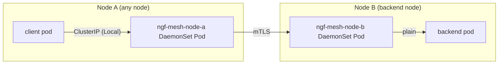
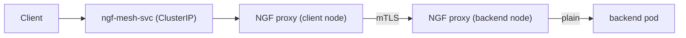

# Proposal: East/West Mesh

- Status: Provisional

## Summary

Add a lightweight East/West mesh to NGINX Gateway Fabric, providing end-to-end mTLS encryption, observability, and
optional policy for service-to-service traffic — without sidecars in user applications, CNI changes, or mutating
webhooks.

## Goals

- Encrypt all traffic flowing through the mesh end-to-end via mTLS, regardless of node locality.
- Support HTTPRoute and TCPRoute for E/W traffic.
- Work with any CNI and any Kubernetes distribution (no iptables manipulation, no CNI-specific features).
- Enable the E/W mesh as an install-time Helm option; no user action is required to provision the data plane.
- Create, distribute, and rotate internal TLS certificates using Kubernetes-native Secret/CSR primitives.
- No sidecars injected into user application pods.
- No mutating webhooks on user resources or Kubernetes-managed resources such as EndpointSlices.

## Non-Goals

- Transparent (iptables-based) traffic interception — traffic routing through the E/W proxy is explicit/opt-in.
- Full GAMMA conformance (transparent iptables-based traffic interception); see the GAMMA section for details.
- UDPRoute — NGINX cannot encrypt UDP (no DTLS support), so UDPRoute E/W is not supported. It may be reconsidered
  in the future if a viable encrypted UDP transport emerges.
- Replacing a full service mesh for use cases that require per-pod identity, automatic mutual TLS for all traffic, or
  a rich L7 policy language.

## Introduction

Service meshes solve E/W problems but bring significant operational overhead: additional control plane components,
dozens of new CRDs, and a sidecar container in every application pod. Many users only need:

1. Encryption when traffic crosses a node boundary.
2. Basic observability (metrics, access logs, traces).
3. Optional coarse-grained policy (rate limiting, authentication).

NGF is already the data path for North/South traffic. This proposal extends it to East/West traffic using per-node NGINX
DaemonSets that act as **node-level explicit proxies**. Because Kubernetes requires pod IPs to be routable across
nodes, each proxy can establish direct mTLS connections to the proxy on the destination node without any CNI
involvement.

The routing model is **explicit**: application pods call the E/W proxy Service endpoint instead of the backend Service
directly. This makes the feature CNI-agnostic and eliminates the need for privileged network manipulation, at the cost
of requiring client applications to use the proxy endpoint.

## Architecture

### Deployment Topology



All traffic follows the same path regardless of protocol: client → ClusterIP → local proxy → mTLS → backend node proxy → backend pod.

All E/W traffic is mTLS-encrypted end-to-end. Same-node and cross-node traffic follow identical paths; there is no
special-casing for locality.

The key Kubernetes primitive enabling CNI-agnostic behaviour is
[`internalTrafficPolicy: Local`](https://kubernetes.io/docs/concepts/services-networking/service-traffic-policy/),
which guarantees traffic on the E/W ClusterIP Service is delivered only to the endpoint on the same node. Combined with
the fact that pod IPs are routable across nodes (a core Kubernetes networking requirement, fulfilled by every CNI),
each per-node proxy can reach any peer proxy pod by its pod IP without any iptables rules or CNI-specific
configuration.

### Components

| Component | Kind | Description |
|-----------|------|-------------|
| E/W GatewayClass | `GatewayClass` | `ngf-mesh`; auto-created at install when mesh is enabled |
| E/W Gateway | `Gateway` | Singleton; auto-created by NGF in the NGF namespace at install time; accepts Routes from all namespaces |
| Per-node NGINX DaemonSet | `DaemonSet` | One per node, named `ngf-mesh-<node-name>`; pinned to its node via `nodeSelector: kubernetes.io/hostname`; contains one NGINX + Agent pod; lives in the NGF namespace |
| Inbound Service | `Service` (ClusterIP, `internalTrafficPolicy: Local`) | One per backend service referenced in a Route; named `ngf-mesh-<service-name>` in the same namespace; auto-created by NGF with a managed EndpointSlice pointing to per-node proxy pod IPs; exposes the native service port externally, mapped to a NGF-allocated internal `targetPort` on the proxy |
| CA Secret | `Secret` in NGF namespace | Internal CA key-pair; never mounted into proxy pods |
| Proxy Cert Secret | `Secret` in NGF namespace | Short-lived cert signed by the CA; shared by all proxy pods |

### Provisioning Flow

The E/W mesh is enabled at install time via a Helm flag:

```shell
helm install nginx-gateway-fabric oci://ghcr.io/nginx/charts/nginx-gateway-fabric \
  --set mesh.enabled=true
```

When `mesh.enabled=true`, the NGF controller automatically creates in the NGF namespace:

1. A **GatewayClass** named `ngf-mesh`.
2. A singleton **Gateway** with `allowedRoutes.namespaces.from: All`, accepting HTTPRoutes and TCPRoutes
   from any namespace.
3. A **per-node DaemonSet** (`ngf-mesh-<node-name>`) for each node currently in the cluster, and watches for
   Node events to create or delete DaemonSets as nodes join or leave.
4. A **Proxy Cert Secret**, signed by the NGF internal CA.
5. A **ConfigMap** for NGINX Agent configuration (same pattern as today).

No user action is required to provision the data plane. Users only create Routes.

Each per-node DaemonSet is pinned to its node via `nodeSelector: kubernetes.io/hostname: <node-name>` and
inherits the node's taints as tolerations at creation time. If a node's taints change, NGF updates the
corresponding DaemonSet. Additional tolerations can be set globally via `mesh.daemonset.tolerations` in the
Helm values.

When a Route is created, the NGF controller:

1. Generates a **distinct NGINX configuration per node** and delivers each via the existing NGINX Agent gRPC
   channel to the corresponding per-node DaemonSet. Because each per-node DaemonSet is a separate Kubernetes
   object with its own Agent connection, the existing per-deployment config push model is reused without
   modification.
2. For each backend service referenced in the Route, creates a `ngf-mesh-<service-name>` ClusterIP Service
   (selector-less, `internalTrafficPolicy: Local`) and a managed EndpointSlice in the Route's namespace.
   The Service exposes the backend's native port and maps it to an NGF-allocated internal `targetPort` on the
   proxy. Clients in the same namespace can reach the backend via the short name `ngf-mesh-<service-name>`,
   regardless of which namespace the backend actually lives in.

When a Route is deleted, the corresponding Service and EndpointSlice are removed.

NGF sets a condition on the Route once the `ngf-mesh-*` Service and EndpointSlice have been successfully
created:

```yaml
conditions:
  - type: Accepted
    status: "True"
    reason: Accepted
    message: "ngf-mesh-postgres-cluster-rw Service and EndpointSlice created successfully."
```

The Route's `Accepted: True` condition is the signal that the `ngf-mesh-*` Service is ready for use. CI/CD
pipelines and deployment tooling should wait on this condition before deploying or restarting application pods
that depend on the mesh endpoint, avoiding a race between Route reconciliation and application startup.

### Controller Reconciliation

Several resources are managed entirely by the NGF controller and never created or modified by the user.

**Singleton Gateway listeners.** The singleton Gateway is an internal implementation detail — users never
reference it directly. NGF reconciles its listener list whenever Routes are created or deleted, adding a listener
when a new port/protocol combination appears and removing it when the last Route referencing that port is gone.
Listener reconciliation is keyed on the singleton Gateway: all concurrent Route creations funnel into reconcile
calls for the same key, controller-runtime deduplicates and processes them one at a time, and any write conflict
is resolved by Kubernetes optimistic concurrency (retry on 409). Leader election ensures only one controller
instance performs this reconciliation.

**Per-node DaemonSet lifecycle.** NGF watches Node events. When a node joins the cluster, NGF creates a
`ngf-mesh-<node-name>` DaemonSet pinned to that node, generates its initial NGINX config, and pushes it via
the Agent gRPC channel. When a node leaves, NGF deletes the corresponding DaemonSet and removes its pod IP
from all managed EndpointSlices.

**Per-service Inbound Services and EndpointSlices.** For each backend service referenced in a Route, NGF creates
a selector-less `ngf-mesh-<service-name>` ClusterIP Service with `internalTrafficPolicy: Local` and a managed
EndpointSlice in the same namespace. Each endpoint contains a per-node proxy pod IP and its `nodeName`, which is
what kube-proxy uses to enforce local-only routing. The Service exposes the backend's native port externally and
maps it to an NGF-allocated `targetPort` on the proxy, so the proxy can differentiate between two backend
services that happen to share the same native port. When the Route is deleted, the corresponding Service and
EndpointSlice are deleted.

**RBAC implications.** The NGF controller needs cluster-scoped permission to create, update, and delete
`Services` and `EndpointSlices` in namespaces where Routes exist. This is broader than today's controller
permissions; see the Security Model section for a full discussion and comparison with traditional service meshes.

**Internal port allocation.** Each `ngf-mesh-<service-name>` Service maps the backend's native port to an
NGF-allocated `targetPort` on the proxy. The allocated port is stored as an annotation
(`mesh.nginx.org/allocated-port`) directly on the `ngf-mesh-<service-name>` Service itself — no separate
ConfigMap or CRD is required.

On controller restart, the leader reconstructs its in-memory port allocation map by listing all Services labelled
`app.kubernetes.io/managed-by: nginx-gateway-fabric` and reading their annotations. Concurrent allocation races
are not a concern: NGF already uses leader election so only one controller instance reconciles at a time, and
controller-runtime's reconciler is single-threaded per resource type within a single instance. Partial failure is
safe by construction — the annotation is only written as part of the Service creation call; if that call fails,
no port is recorded and the next reconcile retries from a clean state.

This allows two services with the same native port to coexist without conflict, and is invisible to users. The
allocated ports are on the pod network only and do not conflict with N/S Gateway ports.

### NGINX Configuration

The NGF controller reads EndpointSlices (read-only, no modifications) to determine which backend pod IPs are on which
nodes. It generates a distinct NGINX configuration per node and pushes each via the Agent to the corresponding
per-node DaemonSet.

#### Listener ports — no Host header required

The **Gateway listener port** is the routing key for client traffic. Each listener gets its own server block.
For each backend service referenced in a Route, NGF auto-creates a `ngf-mesh-<service-name>` ClusterIP Service
with `internalTrafficPolicy: Local` and a managed EndpointSlice listing the per-node proxy pod IPs. Clients reach
the backend via the short name `ngf-mesh-<service-name>` on the backend's native port. The connection is always
delivered to the proxy pod on the same node as the client.

The **inter-proxy mTLS port** is separate and not exposed on any Inbound Service. Peer proxies connect to it
directly via pod IP. SNI on this channel identifies which backend service the connection is for, and the receiving
proxy forwards it plain to the local backend pods.



No Host header. No application-side TLS. Clients call the E/W service on the right port, exactly as they would any
other Kubernetes Service.

#### Per-node NGINX configuration

Each per-node DaemonSet has its own Agent connection, so NGF pushes a **distinct NGINX configuration** to each
using the existing per-deployment config push model — no changes to the Agent communication protocol are required.

The controller reads EndpointSlices for the backend services (the same read-only EndpointSlice watch that powers
N/S routing). Each endpoint in an EndpointSlice carries a `nodeName` field. NGF uses this to partition backend
pod IPs by node: the receiving-side upstreams for the DaemonSet on Node X contain only the backend pod IPs whose
`nodeName` is Node X.

This means the sending-side config sees **all** peer proxy pod IPs in its inter-proxy upstream (load-balancing
across the whole cluster), while the receiving-side config for each service contains **only the backend pods
local to that node**. Locality is baked into the generated config at reconcile time; no runtime detection or
filtering is needed.

#### Sending node

HTTPRoute services are configured in the **HTTP context** on the sending node. NGINX applies L7 routing, header
manipulation, timeouts, and retries here, then forwards to the receiving node over mTLS. TCPRoute services are
configured in the **stream context** on the sending node as a straight mTLS passthrough.

**Sending node — stream context (TCPRoute):**

```nginx
stream {
    upstream ngf_mesh_db_my-app_inter {
        server 10.0.1.100:19000;  # node A proxy pod IP
        server 10.0.2.100:19000;  # node B proxy pod IP
        server 10.0.3.100:19000;  # node C proxy pod IP
    }

    server {
        listen                        19002;  # NGF-allocated targetPort for this service
        proxy_pass                    ngf_mesh_db_my-app_inter;
        proxy_ssl                     on;
        proxy_ssl_certificate         /certs/tls.crt;
        proxy_ssl_certificate_key     /certs/tls.key;
        proxy_ssl_trusted_certificate /certs/ca.crt;
        proxy_ssl_verify              on;
        proxy_ssl_server_name         on;
        proxy_ssl_name                db.my-app.ew.internal;
    }
}
```

**Sending node — HTTP context (HTTPRoute):**

```nginx
http {
    upstream ngf_mesh_svc-a_my-app_inter {
        server 10.0.1.100:19001;  # node A proxy pod IP
        server 10.0.2.100:19001;  # node B proxy pod IP
        server 10.0.3.100:19001;  # node C proxy pod IP
    }

    server {
        listen 19003;  # NGF-allocated targetPort for this service
        location / {
            proxy_pass                    https://ngf_mesh_svc-a_my-app_inter;
            proxy_ssl_certificate         /certs/tls.crt;
            proxy_ssl_certificate_key     /certs/tls.key;
            proxy_ssl_trusted_certificate /certs/ca.crt;
            proxy_ssl_verify              on;
            proxy_ssl_server_name         on;
            proxy_ssl_name                svc-a.my-app.ew.internal;
        }
    }
}
```

#### Receiving node

The receiving node runs two mTLS listeners: one in the stream context (port `19000`) for TCPRoute traffic, and one in
the HTTP context (port `19001`) for HTTPRoute traffic. After mTLS termination, SNI (stream) or `server_name` (HTTP)
identifies the target service. Each service upstream contains only the backend pod IPs resident on **this node** —
derived from the EndpointSlice `nodeName` field at config generation time.

**Receiving node — stream context (TCPRoute, port 19000):**

```nginx
stream {
    map $ssl_server_name $ngf_mesh_tcp_upstream {
        db.my-app.ew.internal  ngf_mesh_db_my-app_local;
    }

    upstream ngf_mesh_db_my-app_local {
        # Only backend pod IPs resident on THIS node (from EndpointSlice nodeName).
        server 10.0.1.8:5432;
    }

    server {
        listen                 19000 ssl;
        ssl_certificate        /certs/tls.crt;
        ssl_certificate_key    /certs/tls.key;
        ssl_client_certificate /certs/ca.crt;
        ssl_verify_client      on;
        ssl_protocols          TLSv1.3;
        proxy_pass             $ngf_mesh_tcp_upstream;
    }
}
```

**Receiving node — HTTP context (HTTPRoute, port 19001):**

```nginx
http {
    upstream ngf_mesh_svc-a_my-app_local {
        # Only backend pod IPs resident on THIS node (from EndpointSlice nodeName).
        server 10.0.1.5:8080;
        server 10.0.1.6:8080;
    }

    server {
        listen       19001 ssl;
        server_name  svc-a.my-app.ew.internal;
        ssl_certificate        /certs/tls.crt;
        ssl_certificate_key    /certs/tls.key;
        ssl_client_certificate /certs/ca.crt;
        ssl_verify_client      on;
        ssl_protocols          TLSv1.3;

        location / {
            proxy_pass http://ngf_mesh_svc-a_my-app_local;
        }
    }
}
```

## Protocol Support

### HTTPRoute

Full support. The existing NGF HTTP config generation pipeline (`internal/controller/nginx/config/`) is reused.
The stream listener directs all traffic through the inter-proxy mTLS channel; the HTTP server (L7 observability,
path routing) exists only on the receiving node and proxies to local backends.

### TCPRoute

Full support via the NGINX stream module. The existing `createStreamServers` / `processLayer4Servers` pipeline is
extended with SNI-based inter-proxy routing. The stream listener and mTLS upstream pattern is identical to
HTTPRoute.

### UDPRoute

Not supported. NGINX has no DTLS capability and tunnelling UDP over a TLS-wrapped TCP connection alters the transport
semantics (ordering, timing, loss behaviour) in ways that are visible to applications. Offering unencrypted UDP
routing would be misleading in a feature whose primary value proposition is encryption at the node boundary.

UDPRoute E/W may be reconsidered in a future release if a viable encrypted UDP transport becomes available.

## Certificate Management

### CA Bootstrap

At install time, when `mesh.enabled=true`, the NGF controller:

1. Checks for a `kubernetes.io/tls` Secret named `ngf-ew-ca` in the NGF namespace.
2. If absent, generates a self-signed CA (ECDSA P-256) and stores it with keys `ca.crt` and `ca.key`.
   This extends the existing `generateCA()` logic in `cmd/gateway/certs.go`.
3. The CA Secret **is never mounted into proxy pods**; it remains in the NGF namespace only.

### Proxy Certificates

The controller creates a single proxy cert Secret shared by all per-node proxies:

- **Name**: `ngf-ew-proxy-cert` in the NGF namespace.
- **Type**: `kubernetes.io/tls`.
- **Contents**: `tls.crt`, `tls.key` (proxy cert/key), `ca.crt` (CA cert only — no CA key).
- **SANs**: `*.ew.internal`.
- **Validity**: 24 hours (configurable via Helm / `NginxProxy`).

All proxy pods share a single certificate identity. Node-level trust — not per-pod identity — is the security
boundary for this feature, making a shared cert the right fit. Per-node certificates may be revisited in a future
phase if stronger workload identity requirements emerge.

### Rotation

The NGF controller runs a reconcile loop that:

1. Reads the proxy cert `NotAfter` field.
2. If within the rotation threshold (default: 4 hours before expiry), generates and stores a new cert.
3. Pushes the updated Secret reference to each per-node proxy via the NGINX Agent gRPC channel.
4. NGINX performs a graceful reload — in-flight connections complete on the old cert.

### Kubernetes-native primitives

| Primitive | Purpose |
|-----------|---------|
| `kubernetes.io/tls` Secret | CA key-pair and proxy cert; both in the NGF namespace |
| `controller-runtime` Secret watch | Detect out-of-band changes or deletions and re-issue |
| Go `crypto/x509`, `crypto/ecdsa` | Certificate generation — reuses patterns from `cmd/gateway/certs.go` |
| Volume mount from Secret | Deliver proxy certs to per-node proxy pods |

The Kubernetes CSR API (`certificates.k8s.io/v1`) is intentionally deferred: it requires a cluster-level signer and
additional RBAC surface. It is offered as a future alternative for users who want externally auditable certificate
issuance.

## Cluster-Scoped Operation

The E/W mesh is cluster infrastructure, not per-namespace infrastructure. There is one per-node DaemonSet per node,
one singleton Gateway, and one proxy cert Secret — all in the NGF namespace.

- Routes in any namespace reference their backend Service directly via `parentRef: kind: Service`; the singleton Gateway is an implementation detail users never interact with.
- The CA Secret and proxy cert Secret live in the NGF namespace only.
- The proxy pod ServiceAccount has no Kubernetes API access (same principle of least privilege as the N/S data
  plane).

## User Workflow

### Step 1 — Platform team: enable at install time

```shell
helm install nginx-gateway-fabric oci://ghcr.io/nginx/charts/nginx-gateway-fabric \
  --set mesh.enabled=true
```

NGF creates a per-node DaemonSet for each cluster node, the GatewayClass, and the singleton Gateway automatically.
No further infrastructure work is required from the platform team.

### Step 2 — Application team: attach Routes

Without the mesh, no Routes are needed — clients call backend Services directly and traffic is unencrypted with
no observability:

```
client (my-app) → postgres-cluster-rw.postgres.svc.cluster.local:5432   # plain TCP, no metrics
client (my-app) → svc-a:8080                                              # plain HTTP, no metrics
```

To opt a Service into the mesh, create an HTTPRoute or TCPRoute **in the client's namespace** with `parentRef`
pointing to the backend Service. The Route's namespace determines where NGF creates the `ngf-mesh-*` Service,
giving clients in that namespace a short-name alias regardless of where the backend actually lives.

```yaml
# routes.yaml — created by the application team in the client namespace (my-app)
apiVersion: gateway.networking.k8s.io/v1
kind: HTTPRoute
metadata:
  name: svc-a
  namespace: my-app          # client namespace — ngf-mesh-svc-a will be created here
spec:
  parentRefs:
    - name: svc-a
      namespace: my-app      # namespace where the backend Service lives
      kind: Service
      group: ""
  rules:
    - backendRefs:
        - name: svc-a
          port: 8080
---
apiVersion: gateway.networking.k8s.io/v1alpha2
kind: TCPRoute
metadata:
  name: postgres
  namespace: my-app          # client namespace — ngf-mesh-postgres-cluster-rw will be created here
spec:
  parentRefs:
    - name: postgres-cluster-rw
      namespace: postgres    # backend Service lives in a different namespace
      kind: Service
      group: ""
  rules:
    - backendRefs:
        - name: postgres-cluster-rw
          namespace: postgres
          port: 5432
```

NGF responds by creating `ngf-mesh-svc-a` and `ngf-mesh-postgres-cluster-rw` Services in `my-app` and sets
`Accepted: True` on the Route once both the Service and EndpointSlice are ready. Deployment tooling should
wait on this condition before rolling out application pods that use the mesh endpoint.

### Step 3 — Application developer: change one hostname

The only application change is the service hostname. Port, protocol, and application code are unchanged.

| | Before (non-meshed) | After (meshed) |
|---|---|---|
| HTTP service (same namespace) | `http://svc-a:8080` | `http://ngf-mesh-svc-a:8080` |
| Postgres (different namespace) | `postgres://postgres-cluster-rw.postgres.svc.cluster.local:5432` | `postgres://ngf-mesh-postgres-cluster-rw:5432` |

Because the `ngf-mesh-*` Service is created in the client's namespace, clients always use the short DNS name
regardless of where the backend lives. Cross-namespace connections — which previously required a full FQDN —
become identical in form to same-namespace connections.

To opt **out**, stop using the `ngf-mesh-` prefixed hostname. No Route or Service cleanup is required from the
application developer — that is the application team's responsibility.

No code changes, no new dependencies, no sidecar containers.

---

## API and User Experience

### GatewayClass and Gateway

Both are auto-created by NGF at install time when `mesh.enabled=true`. Users do not create or manage them —
they are implementation details. The GatewayClass name (`ngf-mesh`) and Gateway name (`ngf-mesh`) are
configurable via Helm values.

### HTTPRoute (E/W)

```yaml
apiVersion: gateway.networking.k8s.io/v1
kind: HTTPRoute
metadata:
  name: svc-a
  namespace: my-app
spec:
  parentRefs:
    - name: svc-a
      namespace: my-app
      kind: Service
      group: ""
  rules:
    - backendRefs:
        - name: svc-a
          port: 8080
```

Client pods call `http://ngf-mesh-svc-a:8080`.
All traffic is mTLS-encrypted end-to-end. The only application change is the service hostname.

### TCPRoute (E/W)

```yaml
apiVersion: gateway.networking.k8s.io/v1alpha2
kind: TCPRoute
metadata:
  name: db-route
  namespace: my-app
spec:
  parentRefs:
    - name: postgres
      namespace: my-app
      kind: Service
      group: ""
  rules:
    - backendRefs:
        - name: postgres
          port: 5432
```

Client pods connect to `ngf-mesh-postgres-cluster-rw:5432`.

### NginxProxy extensions for E/W

```yaml
spec:
  eastWest:
    interNodeTCPPort:  19000     # inter-proxy mTLS port for TCPRoute traffic (default: 19000)
    interNodeHTTPPort: 19001     # inter-proxy mTLS port for HTTPRoute traffic (default: 19001)
    certValidity: 24h            # proxy cert lifetime (default: 24h)
    certRotationThreshold: 4h   # rotate this long before expiry (default: 4h)
```

### Inter-proxy Ports

There are two inter-proxy mTLS ports on each receiving proxy pod, both configurable via `NginxProxy`:

| Port | Default | Protocol | Purpose |
|------|---------|----------|---------|
| `interNodeTCPPort` | `19000` | stream | Receives mTLS TCPRoute traffic; SNI identifies the target service |
| `interNodeHTTPPort` | `19001` | HTTP | Receives mTLS HTTPRoute traffic; `server_name` identifies the target service; enables full L7 observability and policy on the receiving node |

Because all per-node DaemonSets share the same NGINX config template, no port auto-allocation is required for the inter-proxy ports.
The NGF-allocated `targetPort` values used by the `ngf-mesh-<service-name>` Services are a separate concern and are
managed internally by the controller.

## GAMMA Initiative Support

The [GAMMA initiative](https://gateway-api.sigs.k8s.io/concepts/gamma/) defines how Gateway API resources can express
service mesh (E/W) intent, notably by allowing an HTTPRoute's `parentRef` to point to a `Service` rather than a
`Gateway`. This is standardised in [GEP-1294](https://gateway-api.sigs.k8s.io/geps/gep-1294/).

This proposal follows the GAMMA model exclusively: Routes use `parentRef: kind: Service` to declare E/W intent,
and the singleton Gateway is an internal implementation detail that users never interact with. This is more
natural for E/W use cases than Gateway-style `parentRef` — users are expressing "mesh-enable this Service",
which maps directly to what they're doing.

When NGF detects a Route with `parentRef.kind: Service`, it automatically associates the Route with the singleton
E/W Gateway and proceeds with normal config generation. No knowledge of the Gateway name or namespace is required.

### Spec conformance

GEP-1294 defines the `parentRef: kind: Service` pattern for xRoute in general — it explicitly lists `HTTP`,
`GRPC`, `TCP`, `TLS`, and `UDP` as route types available for mesh implementations. Both HTTPRoute and TCPRoute
with `parentRef: kind: Service` are spec-conformant under GEP-1294.

### Explicit opt-in only

Clients must still be directed to the `ngf-mesh-<service-name>` endpoint (explicit opt-in). Full GAMMA
conformance — where the mesh transparently intercepts **all** traffic to a Service regardless of client
configuration — requires iptables-based redirection and is out of scope for this proposal.

## Observability

Each per-node proxy is configured with the same observability stack as the N/S data plane:

- **Prometheus metrics**: standard NGINX metrics plus E/W labels `ngf_mesh_src_node`, `ngf_mesh_dst_node`, `ngf_mesh_encrypted`.
- **Access logs**: structured JSON including upstream node, encryption status, and upstream response time.
- **OpenTelemetry traces**: NGINX's native OTel module (`ngx_otel_module`, available in NGINX OSS ≥ 1.23.4 and
  NGINX Plus) instruments each HTTP request as it passes through the proxy. The module reads and propagates the
  W3C `traceparent` header, so a trace started by a client application flows through the E/W proxy hops and into
  the backend pod without any application-side instrumentation. Spans include upstream address, response status,
  and latency. TCP trace propagation is out of scope as the stream module has no header visibility.

## Policy

E/W Routes support the same policy attachment model as N/S Routes. Policies are attached via NGF's
`ObservabilityPolicy` and `ClientSettingsPolicy` CRDs or standard Gateway API policy resources, and apply at the
HTTPRoute or TCPRoute level.

Supported policies for E/W traffic:

| Policy | Applies to | Notes |
|--------|-----------|-------|
| Rate limiting | HTTPRoute | Limits requests per route per client IP; implemented via `ngx_http_limit_req_module` |
| JWT authentication | HTTPRoute | Verifies a Bearer token before forwarding; NGINX Plus only |
| Request/response header manipulation | HTTPRoute | Add, set, or remove headers via `proxy_set_header` / `add_header` |
| Timeouts | HTTPRoute, TCPRoute | Connect and read timeouts via `proxy_connect_timeout` / `proxy_read_timeout` |
| Retries | HTTPRoute | Retry on upstream error or timeout via `proxy_next_upstream` |

mTLS between proxies is always on and is not configurable as a policy — it is a property of the mesh itself.

## Security Model

| Concern | Mitigation |
|---------|-----------|
| CA key exposure | CA key stays in NGF controller namespace only; never mounted into proxy pods |
| Proxy cert compromise | Short-lived certs (24h); cert is cluster-scoped so rotation is immediate cluster-wide |
| Rogue proxy joins | mTLS requires a cert signed by the NGF internal CA; only the controller issues them |
| All E/W traffic encrypted | All E/W traffic is mTLS end-to-end, including same-node; the trust boundary is the proxy cert |
| Proxy pod privileges | No `NET_ADMIN`, no `hostNetwork`, no `hostPID`; read-only filesystem (same as N/S data plane) |
| API access from data plane | Proxy pods have no Kubernetes API access; EndpointSlices are read by the controller only |
| Controller RBAC expansion | The NGF controller requires cluster-scoped permission to create and delete `Services` and `EndpointSlices` in namespaces where Routes exist. This is broader than today's NGF permissions and should be called out clearly in documentation. However, it is significantly narrower than the permissions required by traditional service meshes: Istio and Linkerd both require cluster-wide mutating webhook configurations (which can intercept and modify any resource in any namespace), cluster-wide Secret read access for cert distribution, and near cluster-admin privileges for their control planes. This proposal requires write access to only two resource types, only in namespaces where the user has already opted in by creating a Route, with no webhook and no pod mutation. All NGF-managed Services and EndpointSlices carry a well-known label (`app.kubernetes.io/managed-by: nginx-gateway-fabric`) so the scope of controller activity is auditable. |

## Implementation Phases

| Phase | Scope |
|-------|-------|
| 1 | `mesh.enabled` Helm flag; install-time provisioning of per-node DaemonSets, GatewayClass, and singleton Gateway; Node watch for DaemonSet lifecycle; internal CA + proxy cert lifecycle; per-node distinct NGINX config push; HTTPRoute and TCPRoute E/W with end-to-end mTLS; GAMMA-style `parentRef: kind: Service` support; Prometheus metrics |
| 2 | OTel tracing via `ngx_otel_module` for HTTP routes; policy attachment (rate limiting, timeouts, retries, header manipulation); BackendTLSPolicy integration for backend-side TLS |
| 3 | JWT authentication (NGINX Plus) |

## Alternatives Considered

### Sidecar per application pod

The standard service mesh approach (Istio, Linkerd). Rejected because it requires mutating admission webhooks and
adds operational complexity to every application deployment — exactly what this proposal avoids.

### CNI-level encryption (Cilium WireGuard, Calico WireGuard)

Node-level WireGuard is low-overhead but CNI-specific. Users who already have this capability in their CNI do not
need NGF E/W; users who do not should not be required to change CNI. The goal is CNI-agnostic support.

### Namespace-scoped NGF mode

Each namespace-scoped NGF instance would manage its own E/W DaemonSet. This preserves strict namespace isolation but
results in one DaemonSet per team per node, which is wasteful at scale. Cluster-scoped mode achieves the same
security boundary via RBAC on route resources. Namespace-scoped E/W is out of scope for this proposal.

### Per-Gateway DaemonSet provisioning

An earlier design had users create a `Gateway` per namespace to trigger DaemonSet provisioning, following the same
provisioner pattern as N/S Gateways. This gives stronger namespace isolation and an independent lifecycle per team,
but results in one DaemonSet per namespace per node — wasteful at scale — and forces application teams to manage
Gateway objects they don't care about. Treating the mesh as cluster infrastructure (install-time, single DaemonSet)
is simpler and better matches how users think about mesh-like features.

### Single cluster-wide DaemonSet with per-pod config differentiation

A single cluster-wide DaemonSet is the conventional Kubernetes approach and avoids the object-count and churn
concerns of per-node DaemonSets. It is simpler to operate and would be the preferred model if the Agent
communication protocol supported sending distinct configurations to individual pods within the same deployment.

It does not. The current Agent model sends one configuration per managed deployment — all pods in a DaemonSet
receive the same config. Per-node receiving-side upstreams require distinct configs, because each proxy must
forward to only the backend pods resident on its own node. Achieving this with a single DaemonSet would require
either extending the Agent protocol to support per-pod config targeting (a cross-team dependency with non-trivial
scope), or moving local-pod discovery out of the generated config and into runtime logic on the data plane (which
would require Kubernetes API access from the proxy — violating the principle of least privilege).

Per-node DaemonSets avoid both of these by making each proxy a separate Kubernetes object with its own Agent
connection, reusing the existing per-deployment config push model without modification. The object-count cost is
real — a 200-node cluster produces 200 DaemonSet objects — but DaemonSet create/delete is a lightweight
operation, the Node watch + DaemonSet lifecycle controller closely mirrors the existing Gateway provisioner, and
clusters large enough for this to matter are also large enough that the per-node config correctness requirement
outweighs the object overhead. This pattern is established in production by piraeus-operator.

If the Agent protocol is extended in future to support per-pod config targeting, migrating to a single
cluster-wide DaemonSet would be straightforward and is explicitly left open as a future simplification.

### Kubernetes CSR API for certificate issuance

The CSR API requires a cluster-level signer (or an auto-approver with cluster-admin) and additional RBAC surface. The
self-signed CA approach reuses the existing `cmd/gateway/certs.go` machinery and keeps the trust boundary entirely
within NGF's namespace. CSR API remains available as a future option for users who want externally auditable issuance.

## Decisions

| Decision | Resolution |
|----------|-----------|
| Cert identity granularity | Single shared certificate for all proxy pods cluster-wide. Per-node certs deferred. |
| UDPRoute support | Not supported. NGINX cannot encrypt UDP; offering unencrypted routing contradicts the feature's purpose. May be revisited if a viable encrypted UDP transport becomes available. |
| Same-node encryption | All E/W traffic is mTLS-encrypted end-to-end, including same-node. Simplicity and uniform security posture outweigh the marginal overhead of loopback TLS. |
| Port model | One `ngf-mesh-<service-name>` Service per backend service; native port exposed externally, NGF-allocated `targetPort` used internally so two services sharing the same native port can coexist. Two fixed inter-proxy mTLS ports (TCP: `19000`, HTTP: `19001`), neither exposed on any Inbound Service. Sending node: TCPRoute → stream context, HTTPRoute → HTTP context with `proxy_pass https://`. Receiving node: TCP stream listener (SNI routing), HTTP listener (`server_name` routing), both with per-node local-only upstreams derived from EndpointSlice `nodeName`. |
| Protocol declaration | Explicit (`protocol: HTTP` or `protocol: TCP`). HTTP unlocks L7 observability and path routing. TCP is pure passthrough. Listener ports should match the service's native port so clients only change the hostname. |
| Inter-proxy ports | Two fixed ports: TCP `19000` and HTTP `19001`, both configurable via `NginxProxy`. No auto-allocation needed; all per-node DaemonSets share the same port config. |
| DaemonSet provisioning | Install-time (`mesh.enabled=true` Helm flag); one `ngf-mesh-<node-name>` DaemonSet per node, created/deleted by the NGF controller as nodes join or leave the cluster. A single cluster-wide DaemonSet was considered but rejected because the Agent protocol does not support per-pod config targeting; see Alternatives Considered. |
| DaemonSet node scheduling | Each per-node DaemonSet is pinned via `nodeSelector: kubernetes.io/hostname` and inherits the node's taints as tolerations at creation time. Global extra tolerations via `mesh.daemonset.tolerations` Helm values. |
| Singleton Gateway | One E/W Gateway per cluster, auto-created in the NGF namespace. Routes from any namespace attach to it. All protocols and ports are expressed as listeners on that Gateway. |
| GAMMA support | Follows the GAMMA model exclusively: `parentRef: kind: Service` only. The singleton Gateway is an internal implementation detail. Full transparent interception (iptables) is out of scope. |

## References

- [Gateway API GAMMA initiative](https://gateway-api.sigs.k8s.io/concepts/gamma/)
- [Gateway API GEP-1294: GAMMA](https://gateway-api.sigs.k8s.io/geps/gep-1294/)
- [Kubernetes Service internalTrafficPolicy](https://kubernetes.io/docs/concepts/services-networking/service-traffic-policy/)
- [NGINX stream proxy_ssl](https://nginx.org/en/docs/stream/ngx_stream_proxy_module.html#proxy_ssl)
- [NGINX http proxy_ssl_certificate](https://nginx.org/en/docs/http/ngx_http_proxy_module.html#proxy_ssl_certificate)
- [NGINX ssl_preread module](https://nginx.org/en/docs/stream/ngx_stream_ssl_preread_module.html)
- [NGF control/data plane split proposal](control-data-plane-split/README.md)
- Existing NGF cert generation: `cmd/gateway/certs.go`
- Existing stream server generation: `internal/controller/nginx/config/stream_servers.go`
